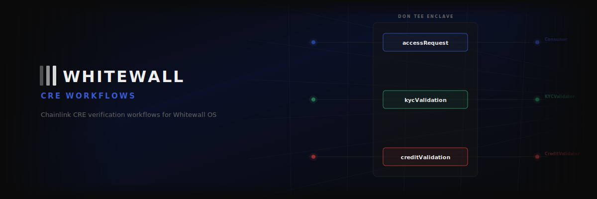
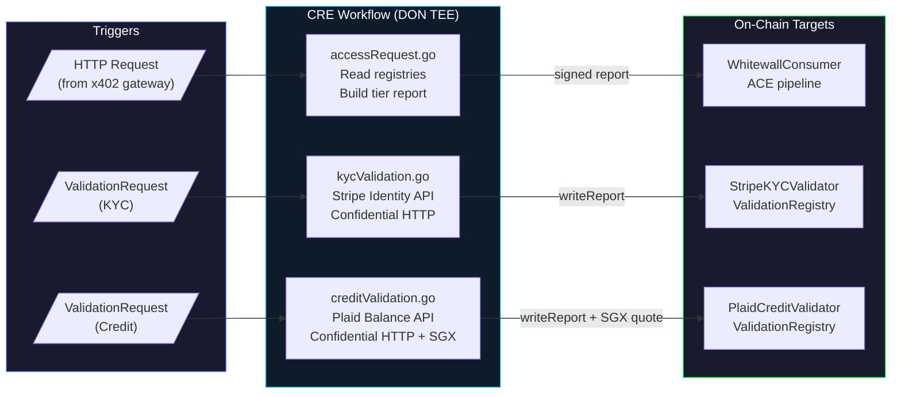

<div align="center">




# whitewall-cre

**Chainlink CRE workflows for Whitewall OS**

[](https://go.dev)
[](https://docs.chain.link/cre)
[](https://sepolia.basescan.org)

> Part of [**Whitewall OS**](https://github.com/hihi-yessir/whitewall-os) — on-chain identity and access control for AI agents.

</div>

---

This repo contains the off-chain verification logic that bridges real-world identity data to on-chain contracts. Three CRE workflows handle access decisions, KYC verification, and credit scoring — all running inside Chainlink's DON with Confidential HTTP (secrets never leave TEE enclaves).

---

## Architecture



---

## Workflows

| Workflow | File | Trigger | Target Contract | What it does |
|:---------|:-----|:--------|:----------------|:-------------|
| **Access** | `accessRequest.go` | HTTP (from x402 gateway) | WhitewallConsumer | Reads identity + verification state, builds signed report, ACE evaluates |
| **KYC** | `kycValidation.go` | `ValidationRequest` event | StripeKYCValidator | Confidential HTTP to Stripe Identity API, writes KYC result |
| **Credit** | `creditValidation.go` | `ValidationRequest` event | PlaidCreditValidator | Confidential HTTP to Plaid, includes SGX attestation quote |

All three are registered as handlers in a single CRE workflow (`workflow.go`). The DON routes events to the correct handler based on trigger type.

---

## Project Structure

```
whitewall-cre/
├── whitewall-access/           # CRE workflow (WASI binary)
│   ├── main.go                 # WASM entrypoint
│   ├── workflow.go             # Handler registration (3 triggers)
│   ├── accessRequest.go        # Access: HTTP → read chain → report
│   ├── kycValidation.go        # KYC: log trigger → Stripe → writeReport
│   ├── creditValidation.go     # Credit: log trigger → Plaid → writeReport
│   ├── types.go                # Shared types
│   ├── config.production.json  # Production contract addresses
│   ├── config.staging.json     # Staging contract addresses
│   ├── secrets.yaml            # DON vault secret references
│   └── workflow.yaml           # CRE workflow descriptor
├── cre-wrapper/                # Local simulation HTTP server
│   ├── main.go                 # Event listener + CRE CLI bridge
│   ├── credit.go               # Plaid credit scoring logic
│   └── health.go               # Health check endpoint
├── contracts/                  # Generated ABI bindings
│   └── evm/
└── Dockerfile                  # Container for cre-wrapper
```

---

## Configuration

**config.json** — contract addresses and chain info:
```json
{
  "validationRegistryAddress": "0x8004Cb1BF31DAf7788923b405b754f57acEB4272",
  "stripeKYCValidatorAddress": "0xebba79075ad00a22c5ff9a1f36a379f577265936",
  "plaidCreditValidatorAddress": "0x07e8653b55a3cd703106c9726a140755204c1ad5",
  "whitewallConsumerAddress": "0x9670cc85a97c07a1bb6353fb968c6a2c153db99f",
  "chainName": "ethereum-testnet-sepolia-base-1",
  "gasLimit": "10000000"
}
```

**secrets.yaml** — references to DON vault entries (Stripe API key, Plaid credentials). Secrets are loaded at runtime inside the TEE.

---

## Setup

```bash
# Install CRE CLI
# See https://docs.chain.link/cre

# Build workflow
cd whitewall-access
go build -target=wasip1 -o workflow.wasm

# Simulate locally
cre workflow simulate whitewall-access --target local-simulation

# Run wrapper (listens for on-chain events, bridges to CRE)
cd ../cre-wrapper
go run .
```

---

## Related Repos

| Repository | Role |
|:-----------|:-----|
| [**whitewall-os**](https://github.com/hihi-yessir/whitewall-os) | Smart contracts, ACE policies, validators, SDK |
| [**whitewall**](https://github.com/hihi-yessir/whitewall) | Demo frontend |
| [**x402-auth-gateway**](https://github.com/hihi-yessir/x402-auth-gateway) | Payment-gated proxy (triggers access workflow) |
